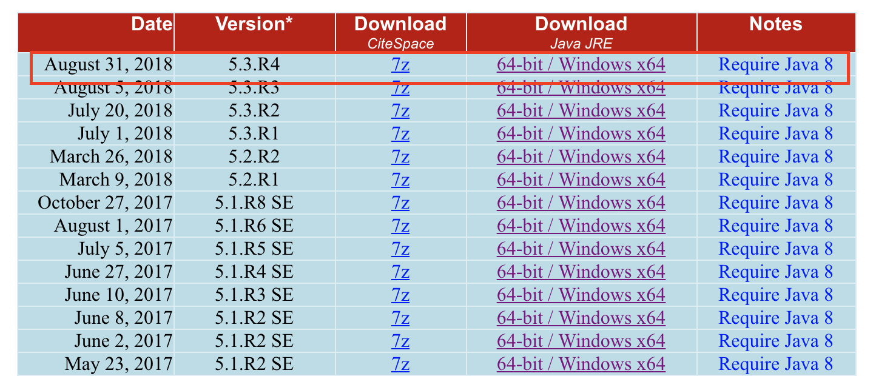
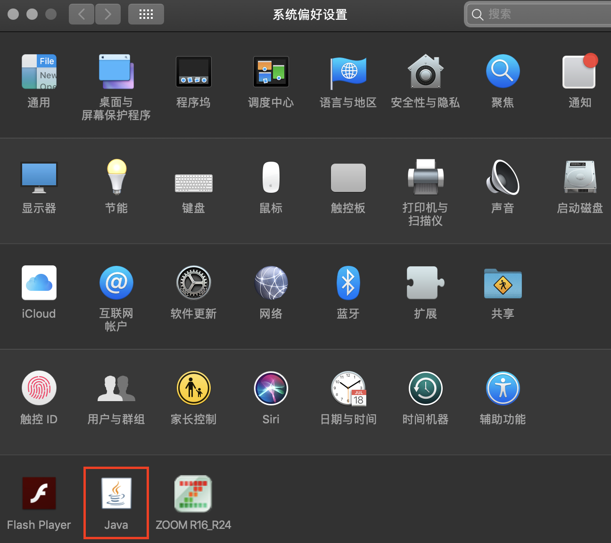
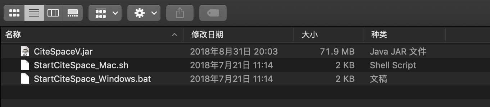
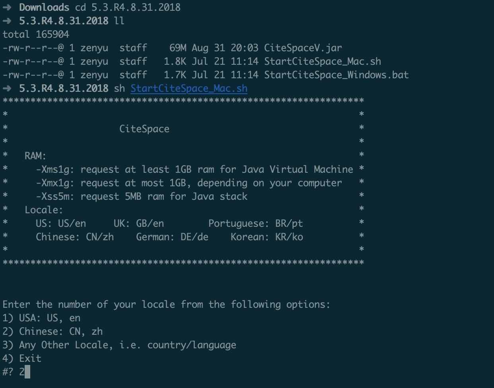
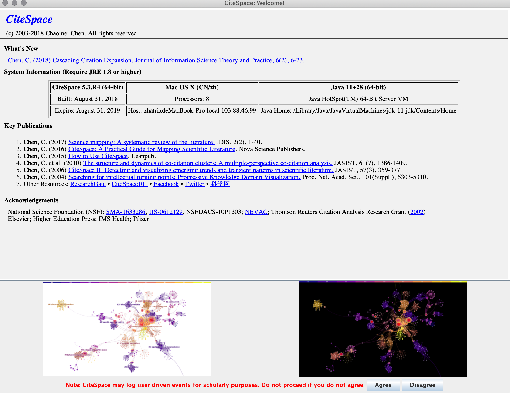
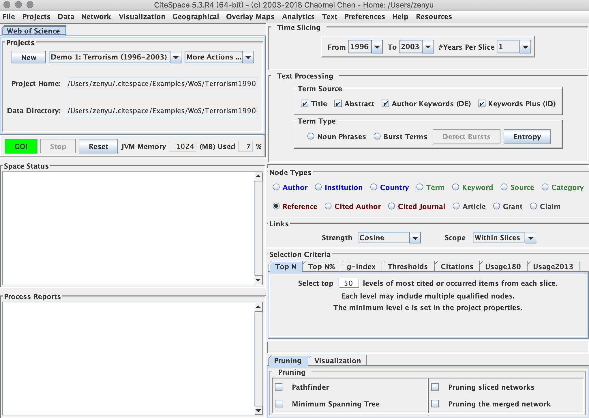

Mac下安装CiteSpace

================

## 下载

在CiteSpace官网下载最新版软件下载[链接](http://cluster.ischool.drexel.edu/~cchen/citespace/download/)

http://cluster.ischool.drexel.edu/~cchen/citespace/download/

下载7z的压缩包，若没有安装JRE的话也需要下载JRE。

## 安装环境

查看“系统偏好设置”检查左下角的Java图标，若没有图表需要下载最新版的Jre。若有图表点击进去查看是否是Java8，不是的话需要更新。

## 打开

Mac上已经安装了“The Unarchiver”，在下载的文件夹内双击文件即把CiteSpace解压到子文件夹下了。没有安装解压软件的同学，搜索一下Mac的命令吧。

打开终端，进入解压后的文件夹：

输入命令：

>   sh StartCiteSpace_Mac.sh

后续按照提示打开CiteSpace。

首次打开会提示缺失的环境，按照提示安装即可。

点击右下角的“agree”进入页面：

## 其他

最可能碰到的是没有安装Java环境JRE和JDK。除了上面讲的下载安装包安装以外，也可以使用 [Homebrew](https://brew.sh/)（macOS下包管理器）进行安装。

安装Homebrew：

>   /usr/bin/ruby -e "$(curl -fsSL https://raw.githubusercontent.com/Homebrew/install/master/install)"

然后通过brew安装java

>   brew cask install java